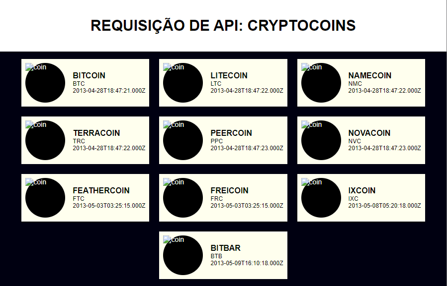

# Cryptocoin

Reading this code you will learn the basic of fetching, with `Fetch API`, taking some information from [coinmarketcap](https://coinmarketcap.com/yield-farming/) site, also, you will learn, as i did, the basic of promises, actualy you will see it in are `Javascript` file represented by `then()` method.

Some lines will look like a boredom for everyone who know how to code, if you dont mind, make you contribuition to that, you can also refactory my code.

#### Take a look, and enjoy.